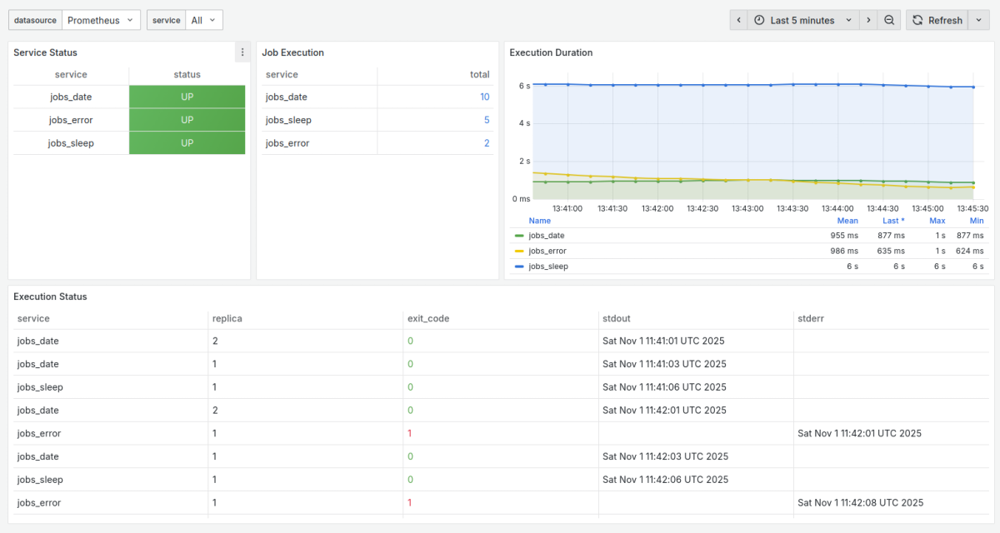

# Cirona
Cirona is a self-configuring job scheduler for Docker Swarm that continues the development of [swarm-cronjob](https://github.com/crazy-max/swarm-cronjob) since version 1.4.0. Cirona implements Docker health-check, Prometheus telemetry and Grafana dashboard.

Features:
- Schedule jobs via Docker labels,
- Replicated and global job modes,
- Overlap prevention,
- Docker registry auth support,
- Timezone configuration,
- Prometheus metrics,
- Grafana dashboard:
  - scheduling status
  - job execution
  - execution duration
  - exit code
  - stdout and stderr line.

## Quickstart

1. Create `docker-compose.cirona.yml`:
  ```dockerfile
  services:
    cirona:
      image: codelev/cirona:latest
      volumes:
        - /var/run/docker.sock:/var/run/docker.sock
      environment:
        - TZ=Europe/Berlin
        - LOGGING=info
      deploy:
        placement:
          constraints:
            - node.role == manager
  ```
2. Deploy the stack: `docker stack deploy -c docker-compose.cirona.yml cirona`
3. Create scheduled jobs as described below.

## Examples

### Print date

An example job that prints the current date every minute:
```dockerfile
services:
  date:
    image: busybox
    command: date
    deploy:
      labels:
        - "cirona.enable=true"
        - "cirona.schedule=* * * * *"
        - "cirona.skip-running=false"
      replicas: 0
      restart_policy:
        condition: none
```

### Database dump

An example job that dumps a MariaDB database every 6 hours, with up to 3 retry attempts on failure:
```dockerfile
services:
  db:
    image: mariadb:10.4
    environment:
      - "MYSQL_ROOT_PASSWORD=rootpassword"
      - "MYSQL_DATABASE=database"
      - "MYSQL_USER=foo"
      - "MYSQL_PASSWORD=bar"
  dump:
    image: mariadb:10.4
    command: bash -c "mkdir -p /dumps && /usr/bin/mysqldump -v -h db -u root --password=rootpassword database | gzip -9 > /dumps/backup-$$(date +%Y%m%d-%H%M%S).sql.gz && ls -al /dumps/"
    depends_on:
      - db
    volumes:
      - "./dumps:/dumps"
    deploy:
      labels:
        - "cirona.enable=true"
        - "cirona.schedule=0 */6 * * *"
        - "cirona.skip-running=true"
      replicas: 0
      restart_policy:
        condition: on-failure
        max_attempts: 3
```

### Docker prune

An example job that cleans up unused Docker data on every node in a Docker Swarm cluster hourly:
```dockerfile
services:
  prune-nodes:
    image: docker
    command: ["docker", "system", "prune", "-f"]
    volumes:
      - /var/run/docker.sock:/var/run/docker.sock
    deploy:
      mode: global
      labels:
        - "cirona.enable=true"
        - "cirona.schedule=0 * * * * *"
        - "cirona.skip-running=true"
      replicas: 0
      restart_policy:
        condition: none
```

## Monitoring

Cirona exposes the following endpoints on port `9100`:
- Health-check `/`:
    - responds `up` and `200 OK` when healthy,
    - responds `down` and `503 Service Unavailable` when unhealthy.
- Prometheus metrics `/metrics`:

| Metric                             | Description                                       |
|------------------------------------|---------------------------------------------------|
| `cirona_service_status`            | Scheduled service status, 0 for down or 1 for up. |
| `cirona_job_executions_total`      | Total number of job executions.                   |
| `cirona_job_execution_status`      | Exit code, stdout and stderr of the job.          |
| `cirona_job_execution_duration_ms` | Duration of the job execution in milliseconds     |

Cirona has an official [Grafana dashboard](https://grafana.com/grafana/dashboards/24321).
You can try it out locally using the commands below, that set up Cirona, Prometheus, Grafana and demo jobs together:

```shell
docker stack deploy -c monitoring/docker-compose.yml cirona
docker stack deploy -c monitoring/docker-compose.jobs.yml jobs
```



Once the stack is running, log in Grafana at http://localhost:3000 with username `admin` and password `admin`.
The [cirona.json](https://github.com/codelev/cirona/tree/main/monitoring/cirona.json) is already installed and ready to use.

## Configuration

Configure a schedule using Docker labels on the target service:

| Name                    | Default | Description                                                                            | Required |
|-------------------------|---------|----------------------------------------------------------------------------------------|----------|
| `cirona.enable`         |         | Set to true to enable Cirona                                                           | Yes      |
| `cirona.schedule`       |         | [CRON expression](https://godoc.org/github.com/robfig/cron#hdr-CRON_Expression_Format) | Yes      |
| `cirona.skip-running`   | `false` | Do not start a job if it is already running                                            | No       |
| `cirona.replicas`       | `1`     | Number of replicas to set when scheduled in `replicated` mode                          | No       |
| `cirona.registry-auth`  | `false` | Send registry authentication details to Swarm agents                                   | No       |
| `cirona.query-registry` |         | Indicates whether the service update requires contacting a registry                    | No       |

### Logging levels

- **fatal**: Indicates an unrecoverable error; the process will exit.
- **error**: Indicates a failure; the process continues running.
- **warn**: Indicates a misbehavior; the process continues running.
- **info**: Indicates normal functional behavior. Default level.
- **debug**: Indicates step‑by‑step functional behavior.

### Time zone

Set the time zone using the `TZ` environment variable in the `cirona` service.

## Development

**Requirements:**
- Golang 1.24

**Build binary:**
```shell
go mod download
go mod tidy
go build -ldflags="-s -w -X main.version=test" -trimpath -o cirona .
LOGGING=debug ./cirona
```

**Build image:**
```shell
docker build --build-arg VERSION=latest -t codelev/cirona:latest .
docker run --rm -p 9100:9100 -e LOGGING=debug -v /var/run/docker.sock:/var/run/docker.sock codelev/cirona:latest
curl http://localhost:9100/metrics
```

## Credits

- [Laurel](https://twitter.com/laurelcomics)
- [CrazyMax](https://crazymax.dev)
